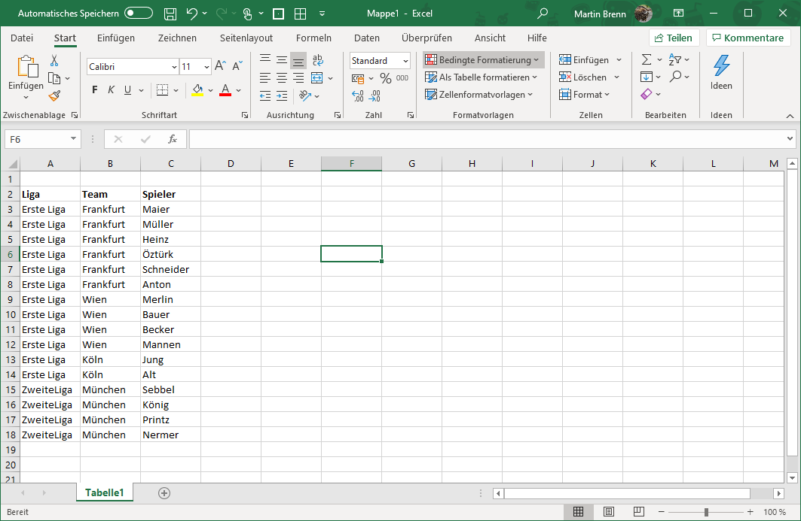

= Import von Excel-Dokumenten

== Hierarchischer Excel Import

Über die Import-Konfiguration 'HierarchicalExcelImportSettings' unterstützt der DatenMeister den Import von Exceldokumenten, die nach folgendem Schema aufgebaut worden sind. 

Diese Tabelle wird in eine Baumstruktur mit drei Ebenen umgewandelt: 

 Liga
 > Team
 > > Spieler

Dazu dient folgende Konfiguration

=== ExcelHierarchicalLoaderConfig

Abgeleitet von ExcelLoaderConfig

[%header,cols="1,5"]
|===
|Name|Bedeutung
|filePath|Dateiname über den importiert wird
|extentUri|Uri des entstehenden Extents
|workspaceId|Id des Arbeitsbereiches in dem der entstehende Extent eingefügt wird
|sheetName|Name des Excel-Sheets aus dem importiert wird
|hasHeader|Flag, ob die erste Spalte des Excelsheets Überschriften bezeichnet
|idColumnName|Name der Spalte, die gegebenenfalls die Id beinhaltet
|countRows|Anzahl der Zeilen, die einzulesen sind. Wenn 0 oder negativ wird versucht automatisch zu ermitteln wieviel Zeilen abzuarbeiten sind
|countColumns|Anzahl der Spalten, die einzulesen sind. Wenn 0 oder negativ wird versucht automatisch zu ermitteln wieviel Spalten abzuarbeiten sind
|offsetRow|Anzahl der Zeilen, die zuerst übersprungen werden um das Excel einzulesen. Damit muss das Excel nicht zwingend bei A1 beginnen. 
|offsetColumn|Anzahl der Spalten, die zuerst übersprungen werden um das Excel einzulesen. Damit muss das Excel nicht zwingend bei A1 beginnen. 
|hierarchicalcolumns|Spalten-Definitionen, die die verschiedenen Hierarchie-Stufen beschreiben. Diese Liste von Elementen beschreibt in der Reihenfolge der Spaltentiefe welche Inhalte beschrieben werden. 
|===

=== ExcelHierarchicalColumnDefinition

[%header,cols="1,5"]
|===
|Name|Bedeutung
|name|Name der Spalte. Dies ist üblicherweise die Überschrift
|metaClass|MetaClass, die diese Spalte beinhaltet
|property|Eigenschaft in dem die Kinder des Elements gespeichert werden. Für die letzte Spalte hat diese Eigenschaft keine Bedeutung mehr. 
|===

