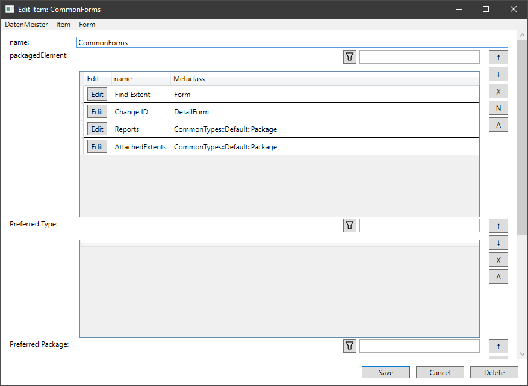

= Formulare finden

Wie im vorherigen Kapital beschrieben sind die Formulare von den eigentlichen Daten entkoppelt. Um das Formular, gegebenenfalls bestehend aus Unterformularen, auswählen zu können, gibt es die _FormAssociation_, die einen Regelsatz festlegt über den das Formular einer Liste, einem Objekt oder einen Extent zugeordnet wird. 

== Die Modelle
=== FormAssociation

In dieser Instanz der Formular-Zuordnung  wird das Regelwerk festgelegt

[%header,cols="1,5"]
|===
|Name|Bedeutung
|name|Name der Formular-Zuordnung
|formType|Typ des Formulars welches zugeordnet werden kann. Die möglichen Typen finden sich in der Tabelle unten wieder
|metaClass|Wenn das selektierte Objekt oder die Liste dahinter von diesem Objekttyp ist, kann diese Zurodnung ausgewählt werden
|extentType|Wenn das Extent von diesem Typ ist, kann dise Zuordnung ausgewählt werden. 
|viewModeId|Wenn der Nutzer in dieser Ansicht ist, kann diese Zuordnung ausgewählt werden
|parentMetaClass|Wenn die Elemente einer Liste ausgewählt werden und das besitzende Objekt von diesem Typ ist, kann dieses ausgewählt erden. 
|parentProperty|Wenn die Elemente einer Liste ausgewählt werden und sich diese Liste in dieser Eigenschaft des besitzenden Objektes befindet, kann dieses ausgewählt ewrden. 
|form|Dies beschreibt das Formular welches ausgewählt werden kann, wenn die Eigenschaften oben zustimmen, soweit sie gewählt sind. 
|===

=== Die Formulartypen

[%header,cols="1,4,1"]
|===
|Name|Bedeutung|Formular
|Detail|Das Formular wird für die Detail-Ansicht eines Items angezeigt.|DetailForm, ExtentForm
|TreeItemExtent|Das Formular wird angezeigt wenn der Nutzer ein bestimmtes Extent ausgewählt hat und alle Elemente des Extents angezeigt werden sollen. |ExtentForm
|TreeItemDetail|Das Formular wird angezeigt wenn der Nutzer ein bestimmtes Element ausgewählt hat und nun in der Baumansicht dieses Element angezeigt werden soll. Dieser typ unterscheidet sich vom Detail, dass das Fenster nicht dediziert für das Element angelegt worden ist. |ExtentForm
|ObjectList|Das Formular wird angezeigt, wenn alle Elemente einer bestimmten Eigenschaft in einer Subliste (SubElementField) angezeigt werden sollen.|ListForm
|TreeItemExtentExtension|Dieses Formular wird dem ExtentForm hinzugefügt, wenn die Beschreibung der Formular-Zuordnung zu dem angezeigtne Formular passt.|Listform, DetailForm
|TreeItemDetailExtension|Dieses Formular wird dem ExtentForm hinzugefügt, wenn die Beschreibung der Formular-Zuordnung zu dem angezeigten Formular passt.|Listform, DetailForm
|===

== Beschreibung des Verfahren

=== Detailansicht

In der Detailansicht wird die Formular-Zuordnung nach folgenden Eigenschaften gesucht:

[%header,cols="1,5"]
|===
|Name|Bedeutung
|formType|DetailForm
|metaClass|Die Meta-Klasse des Objektes welches ausgewählt worden ist. 
|extentType|Typen (Getrennt durch Leerzeichen) des Extents in dem sich das angezeigte Objekt befindet
|===

=== Extentansicht

In der Extentansicht kann der Nutzer entweder das Extent selbst markiert haben oder ein Element im Extent. 

Diese Formulartypen werden _TreeItemExtent_ und _TreeItemDetail_ genannt. 

Für die Darstellung des gesamten Extents werden folgende Eigenschaften in der Formular-Zuordnung definiert: 

==== Extent Basis-Formular für die Baumansicht
[%header,cols="1,5"]
|===
|Name|Bedeutung
|formType|TreeItemExtent
|extentType|Typen des anzuzeigenden Extents
|viewModeId|Die vom Nuutzer ausgewählte Ansicht
|===

==== Extent Listen-Formular für die Baumansicht

Das Extentform besteht aus mehreren Reitern (Tabs). Wird nun ein Reiter automatisch erzeugt, kann eine Metaklasse angegeben werden, die dann die Inhalte beinhaltet.  

[%header,cols="1,5"]
|===
|Name|Bedeutung
|formType|TreeItemExtent
|extentType|Typen des anzuzeigenden Extents
|metaClass|Meta-Klasse der anzuzeigenden Objekte
|===

==== Extent Objekt-Formular für die Baumansicht

Selektiert der Nutzer ein Element in der Baumansicht, so wird die Formular-Zuordnung nach folgendem Schema gesucht (_FormsPlugin.GetItemTreeFormForObject_): 

[%header,cols="1,5"]
|===
|Name|Bedeutung
|formType|TreeItemDetail
|extentType|Typen des anzuzeigenden Extents
|metaClass|Meta-Klasse des anzuzeigenden Objektes
|viewModeId|Die vom Nutzer ausgewählte Ansicht. Ist im Package ein ViewMode als Eigenschaft angegeben, so 
|===

==== Extent Objektlisten-Formular für die Baumansicht

Werden automatisch Formulare für eine Objektansicht, wird je nach Konfiguration (_ConfigurationFormCreatorSeparateProperties_) entweder ein ListForm für jeden Typ und jede Eigenschaft erzeugt oder ein ListForm für jede Eigenschaft, die aber dann alle Objekt-Typen enthält. 

Hier zu werden folgende Eigenschaften genutzt:

[%header,cols="1,5"]
|===
|Name|Bedeutung
|formType|TreeItemDetail
|extentType|Typen des anzuzeigenden Extents
|parentMetaClass|Die Meta-Klasse der Objekte die selektiert sind.
|parentProperty|Der Name der Eigenschaft der Objekte.
|===

==== Automatische Erweiterung der Formulare

Nachdem das Formular gefunden, gewählt und erzeugt worden ist, wird in einer weiteren Abfrage-Runde definiert ob weitere Formularehinzugefügt werden sollen.

Hierzu werden die gleichen Formular-Zurordnungen genutzt, wie oben dargestellt, allerdings mit der Änderung des Form-Types:

. TreeItemExtent => TreeItemExtentExtension
. TreeItemDetail => TreeItemDetailExtension

Hierbei soll ein ListForm zurückgegeben werden.