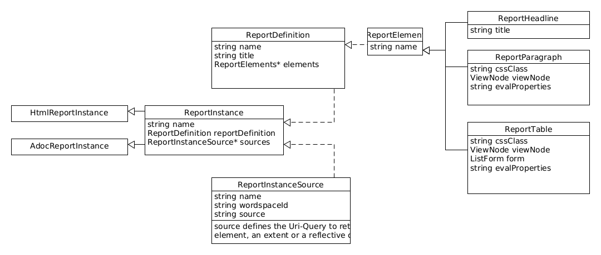

= Reports

Prinzipiell gibt es zwei verschiedene Arten von Reports für den Nutzer: 

. Die einfachen Reports (_SimpleReports_)
. Der vollständige Html Report (_HtmlReportCreator_)

== Einfacher Bericht

Von jedem beliebigen Extent kann über das Auswählen des Menüs 'Create Report' ein einfacher Report über die aktuelle Ansicht generiert werden. 

TODO: BILD

Alternativ kann der Nutzer eine Instanz des Elements 'SimpleRpeortConfiguration' anlegen. In der Detailansicht des Elements wird ein Knopf 'Create Report' angelegt. Über diesen kann der Nutzer dann den Extent oder das Element auswählen über den der Report erzeugt werden soll. 

TODO: Bild

Es wird eine zufällige Datei auf der Festplatte erzeugt, die dann über den Standardbrowser angezeigt wird. 

=== Konfiguration

Der einfache Bericht wird  über die Konfiguration _SimpleReportConfiguration_ eingestellt:

[%header,cols="1,5"]
|===
|Name|Beschreibung
|name|Name der Konfiguration
|rootElement|Das Wurzelelement, dessen Eigenschaften angezeigt werden sollen.
|showDecendents|true, falls auch dessen Kinder angezeigt werden sollen
|showRootElements|true, wenn die Wurzelelemente angezeigt werden sollen
|showMetaClasses|true, falls eine Spalte automatisch eingefügt werden soll, die die Meta-Klasse der Objekte anzeigt
|showFullName|true, falls eine Spalte eingefügt werden soll, die den Pfad (voller Name) zum Objekt anzeugt
|form|Falls kein automatisches Formular erzeugt werden soll, kann hier ein Formular angegeben werden. Dieser muss vom Type _ListForm_ sein.  
|descendentMode|None, Inline, PerPackage
|typeMode|PerType, AllModes
|===

Der DescendentMode legt fest, ob pro Package eine neue Tabelle im Bericht angelegt werden soll. 

Der TypeMode legt fest, ob pro Typ eine neue Tabelle im Bericht angelegt werden soll. 

== Der Html Report

Ein Report wird über zwei Konfiguration definiert: 

. Über einer ReportDefinition kann der Nutzer das Format und die Elemente des Reports definieren. Dieses ist noch nicht mit den Datenquellen gekoppelt. 
. Über die ReportInstance wird dann der eigentliche Report instanziiert. Hier werden die Datenquellen mit der Report Definition verknüpft. 

=== Report Definition

=== Report Instance

Die Report Instance besteht aus einer Referenz zur ReportDefinition und den Quellen der Daten. Diese verbinden den Namen der Quelle zu einer Url über die der DatenMeister die Daten einliest. 

Das Auflösen der Url in der Quelle erfolgt mit Hilfe des WorkspaceResolvers des dazugehörigen Arbeitsbereiches.

Definition *ReportInstance*:
|===
|name|Name der Reportinstanz
|reportDefinition|Referenz auf die Definition des Reports
|sources|Sammlung von ReportInstanceSources, die dem Nutzer pro Report erlauben unterschiedliche Quellen anzugeben. 
|===

==== HtmlReportInstance 

Abgeleitet aus der ReportInstance und ermöglicht den Export eines Html-Dokuments aus der ReporttDefinition. 

==== AdocReportInstance 

Abgeleitet aus der ReportInstance und ermöglicht den Export eines ADoc-Dokuments aus der ReportDefinition. 

=== ReportInstanceSource
|===
|name|Name der Quelle
|url|Url um das Extent, die Sammlung oder das Objekt zu referenzieren. 
|===

=== ReportParagraph:
Drückt einen Absatz im Report aus. Dieser kann einen statischen Text beinhalten oder auch dynamisch über evalParagraph oder evalProperties erzeugt werden. 

[%header,cols="1,5"]
|===
|name|Name des Elements
|paragraph|Standardtext, der angezeigt wird
|viewNode|Falls eine Evaluierung stattfindet, beschreibt die ViewNode-Abfrage welches Objekt selektiert wurde. Das selektierte Objekt ist über die Instanz 'i' in den Parsern verfügbar. 
|cssClass|CSS-Klasse der Tabelle
|evalParagraph|Wird gesetzt, wenn der Absatztext dynamisch erzeugt wird. 
|evalProperties|Wird gesetzt, wenn über den TemplateParser die Eigenschaften der Ansicht geändert werden soll. Die Definition des Absatz selbst ist über 'v' erreichbar. 
|===

=== ReportTable
Beschreibt eine Tabelle, die die Elemente eines ViewNodes ausdrückt. Über eine Formulardefinition werden die Spalten der Tabelle definiert. 

[%header,cols="1,5"]
|===
|name|Name des Elements
|viewNode|Beschreibt die dynamische Abfrage, die die Elemente selektiert, die in der Tabelle angezeigt werden sollen
|form|Definiert das Formular. Dieses Formular soll vom Type _ListForm_ instanziiert sein. 
|cssClass|CSS-Klasse der Tabelle
|evalProperties|Führt eine Evaluierung aus. Die Elemente selbst sind über 'items' abrufbar. 
|===

==== Tabellenzelle des EvalTextFieldData

Eine Tabellenzelle unterstützt folgende Eigenschaften:

[%header,cols="1,5"]
|===
|name|Name des Elements
|text|Textinhalt der Zelle
|cssClass|Im Falle des Html-Reports, die CSS-Klasse der Zelle
|===