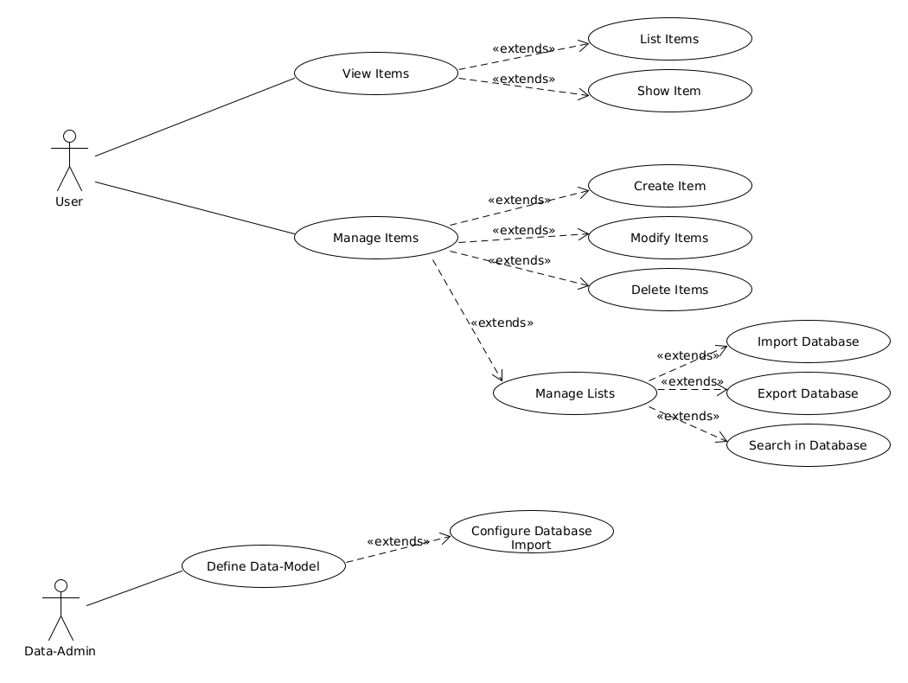

= Die Web-Schnittstelle

Der Nutzer hat folgende Hauptnavigationspunkte: 

- Dashboard
- Arbeitsbereiche
- Daten-Arbeitsbereich
- Einstellungen

== Web-Oberfläche

Das Hauptfenster soll folgende Bereiche beinhalten: 

