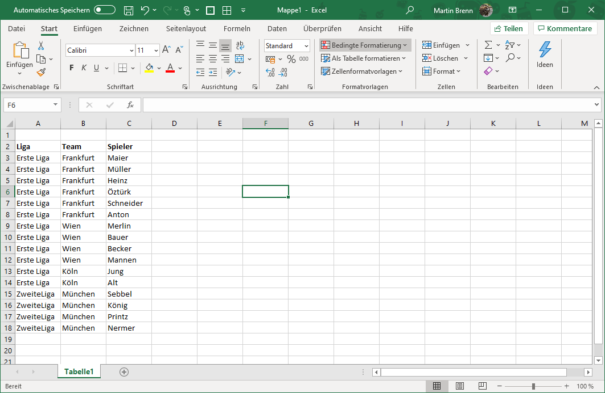

= Import of Excel Documents

== Hierarchical Excel Import

Through the import configuration 'HierarchicalExcelImportSettings', the DatenMeister supports the import of Excel documents structured according to the following scheme.

This table is converted into a tree structure with three levels:

 League
 > Team
 > > Player

The following configuration is used for this:

=== ExcelLoaderConfig

[%header,cols="1,5"]
|===
|Name|Meaning
|filePath|Filename from which to import.
|extentUri|URI of the resulting extent.
|workspaceId|ID of the workspace into which the resulting extent is inserted.
|sheetName|Name of the Excel sheet from which to import.
|hasHeader|Flag indicating whether the first column of the Excel sheet denotes headers.
|idColumnName|Name of the column that optionally contains the ID.
|countRows|Number of rows to be read. If 0 or negative, an attempt is made to automatically determine how many rows to process.
|countColumns|Number of columns to be read. If 0 or negative, an attempt is made to automatically determine how many columns to process.
|offsetRow|Number of rows to be skipped first before reading the Excel. Thus, the Excel does not necessarily have to start at A1.
|offsetColumn|Number of columns to be skipped first before reading the Excel. Thus, the Excel does not necessarily have to start at A1.
|===
=== ExcelHierarchicalLoaderConfig

Derived from ExcelLoaderConfig

[%header,cols="1,5"]
|===
|Name|Meaning

|hierarchicalcolumns|Column definitions describing the different hierarchy levels. This list of elements describes the content in the order of column depth.
|===

=== ExcelHierarchicalColumnDefinition

[%header,cols="1,5"]
|===
|Name|Meaning
|name|Name of the column. This is usually the header.
|metaClass|MetaClass that this column contains.
|property|Property in which the children of the element are stored. For the last column, this property no longer has any meaning.
|===

