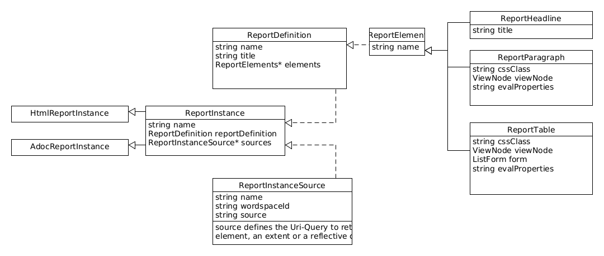

= Reports

In principle, there are two different types of reports for the user:

. Simple reports (_SimpleReports_)
. The complete HTML report (_HtmlReportCreator_)

== Simple Report

From any extent, a simple report about the current view can be generated by selecting the 'Create Report' menu.

TODO: IMAGE

Alternatively, the user can create an instance of the 'SimpleReportConfiguration' element. In the detail view of the element, a 'Create Report' button is created. Through this, the user can then select the extent or the element over which the report is to be generated.

TODO: Image

A random file is created on the hard drive, which is then displayed via the default browser.

=== Configuration

The simple report is configured via the _SimpleReportConfiguration_:

[%header,cols="1,5"]
|===
|Name|Description
|name|Name of the configuration
|rootElement|The root element whose properties are to be displayed.
|showDecendents|true if its children should also be displayed
|showRootElements|true if the root elements should be displayed
|showMetaClasses|true if a column should be automatically inserted showing the metaclass of the objects
|showFullName|true if a column should be inserted showing the path (full name) to the object
|form|If no automatic form is to be generated, a form can be specified here. This must be of type _ListForm_.
|descendentMode|None, Inline, PerPackage
|typeMode|PerType, AllModes
|===

The DescendentMode determines whether a new table should be created in the report for each package.

The TypeMode determines whether a new table should be created in the report for each type.

== The HTML Report

A report is defined via two configurations:

. Via a ReportDefinition, the user can define the format and elements of the report. This is not yet coupled with the data sources.
. The actual report is then instantiated via the ReportInstance. Here, the data sources are linked with the Report Definition.

=== Report Definition

=== Report Instance

The Report Instance consists of a reference to the ReportDefinition and the sources of the data. These connect the name of the source to a URL via which the DatenMeister reads the data.

The resolution of the URL in the source is done with the help of the WorkspaceResolver of the corresponding workspace.

Definition *ReportInstance*:
|===
|name|Name of the report instance
|reportDefinition|Reference to the definition of the report
|sources|Collection of ReportInstanceSources that allow the user to specify different sources per report.
|===

==== HtmlReportInstance

Derived from ReportInstance and enables the export of an HTML document from the ReportDefinition.

==== AdocReportInstance

Derived from ReportInstance and enables the export of an ADoc document from the ReportDefinition.

=== ReportInstanceSource
|===
|name|Name of the source
|url|URL to reference the extent, the collection, or the object.
|===

=== ReportParagraph:
Expresses a paragraph in the report. This can contain a static text or be generated dynamically via evalParagraph or evalProperties.

[%header,cols="1,5"]
|===
|name|Name of the element
|paragraph|Default text that is displayed
|viewNode|If evaluation takes place, the ViewNode query describes which object was selected. The selected object is available via the instance 'i' in the parsers.
|cssClass|CSS class of the table
|evalParagraph|Set if the paragraph text is generated dynamically.
|evalProperties|Set if the template parser is to be used to change the properties of the view. The definition of the paragraph itself is accessible via 'v'.
|===

=== ReportTable
Describes a table that expresses the elements of a ViewNode. The columns of the table are defined via a form definition.

[%header,cols="1,5"]
|===
|name|Name of the element
|viewNode|Describes the dynamic query that selects the elements to be displayed in the table
|form|Defines the form. This form should be instantiated from the type _ListForm_.
|cssClass|CSS class of the table
|evalProperties|Performs an evaluation. The elements themselves are accessible via 'items'.
|===

==== Table Cell of EvalTextFieldData

A table cell supports the following properties:

[%header,cols="1,5"]
|===
|name|Name of the element
|text|Text content of the cell
|cssClass|In the case of the HTML report, the CSS class of the cell
|===