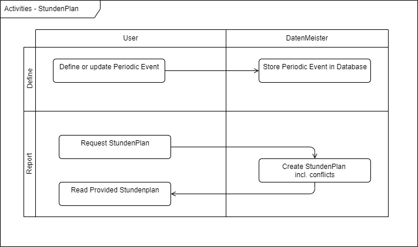

= Der StundenplanMeister

== Terminology

PeriodicEvent: An event which occurs periodically on a certain weekday.

== Use Case

The user wants to define or update periodic events to store them into a database. The task of the system is to maintain this data persistently. 

The user wants to receive a report about the planned events in a 'hourplanning' like format. 

== Data Structure

=== WeeklyPeriodicEvent

[%header]
|===
|Name|Name of the periodic event|Type
|TimeStart|Time at which the event starts (Format is HH:MM)|Text in Format HH:MM
|HoursDuration|Duration of the event in hours|Float
|WeekInterval|Determines how many weeks are between two event. 1 means every week|Integer
|WeekOffset|Determines how many weeks must pass before first event happens.|Integer
|OnMonday|Indication, if event is on Monday|Boolean
|OnTuesday|Indication, if event is on Tuesday|Boolean
|OnWednesday|Indication, if event is on Wednesday|Boolean
|OnThursday|Indication, if event is on Thursday|Boolean
|OnFriday|Indication, if event is on Friday|Boolean
|OnSaturday|Indication, if event is on Saturday|Boolean
|OnSunday|Indication, if event is on Sunday|Boolean
|===

== Activities

=== Define or Update Periodic Events

The user can define a package and adds the periodic events into the database. 

The extent in which the StundenPlan can be created contain the ExtentType 'StundenPlan'.

== Request StundenPlan

The user can select a package and request the creation of a full StundenPlan for all items and its descendents within the package. 

The report can be created by selecting a certain viewmode and by viewing the properties of a package or of an extent. 

The report contains a week-overview with the hours as columns and the weekdays as rows. 

== Technical implementation

Create a new Assembly called 'DatenMeister.StundenPlan'. The assembly shall contain a DatenMeisterPlugin which creates a type and a form definition. This form definition is automatically loaded.

The plugin has to register a new ExtentType called 'StundenPlan'.

The plugin has to register a special viewmode which is neither a TableForm nor a RowForm. 

* The DatenMeister.WebServer itself has to be capable to handle a plugin-concept for Form Types (besides RowForm and TableForm). 
* The DatenMeister.WebServer itself has to be capable to handle additional JavaScript Files

