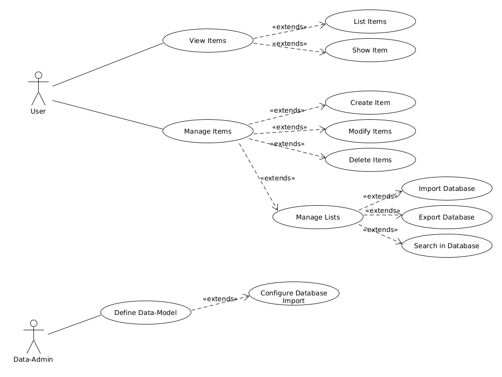

= The Web Interface

The user has the following main navigation points:

- Dashboard
- Workspaces
- Data Workspace
- Settings

== Web Forms

The following two forms are requested via the web:

=== ItemsOverview.cshtml --> DetailFormCreator

- Here, the function of the DetailFormCreator is called.
- This calls the web API forms/default_for_item.
- This calls CreateExtentFormForItem with the parameter: TreeItemDetail.

=== Items.cshtml

- Here, the function of the CollectionFormCreator is called.
- This calls the web API forms/default_for_extent.
- This calls CreateExtentFormForExtent with the parameter: TreeItemExtent.

== Web UI

The main window should contain the following areas:

